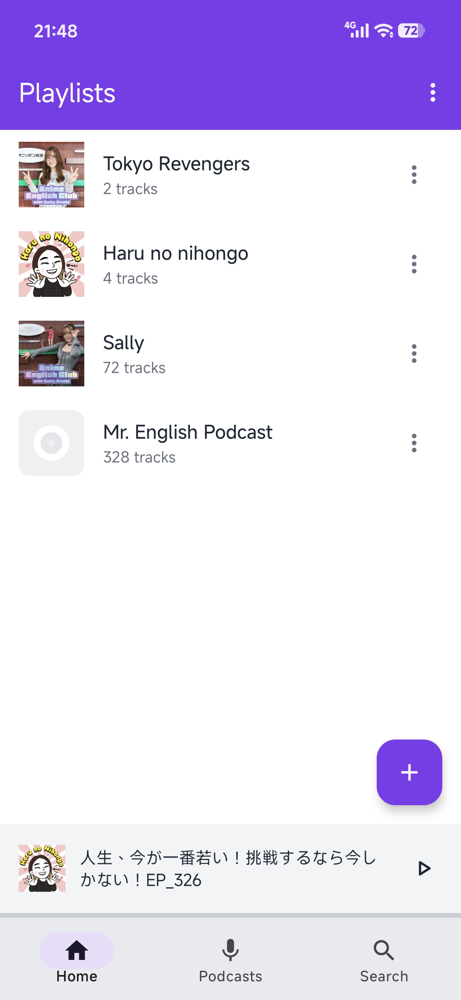
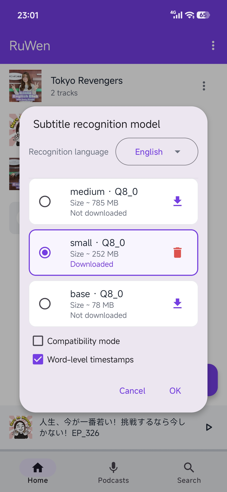
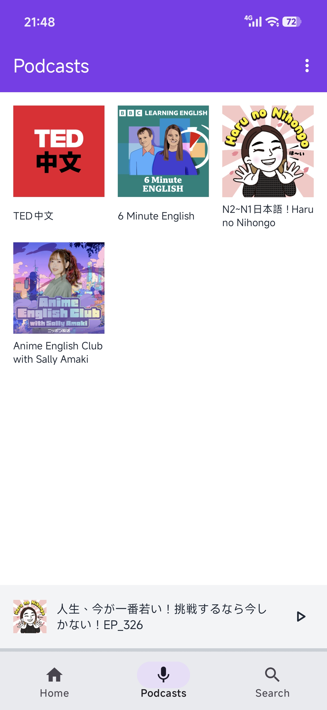
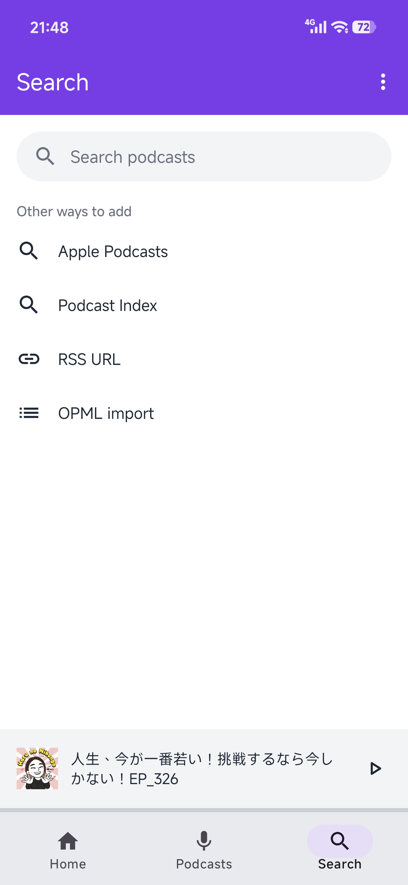

<p align="center">
  <a href="README.md">English</a> ·
  <a href="README.zh-CN.md">简体中文</a>
</p>

<h1 align="center">RuWen (如闻)</h1>

<p align="center">
  一款面向语言学习的安卓离线字幕音频播放器，集 <b>播客订阅</b> 与 <b>端侧字幕生成</b> 于一体。
</p>

---

RuWen 是一款基于 Material Design 的安卓音频播放器，把 **播客订阅** 与 **完全离线的字幕生成** 结合在一起。它内置 [whisper.cpp](https://github.com/ggerganov/whisper.cpp)，**在手机端离线完成语音识别**——无需联网，也不会上传任何本地音频。

- 🌐 **12 种识别语言**（whisper.cpp 官方推荐识别质量最佳的语种），通过纵向单选列表选择。
- 📥 **按语言下载模型**——英语使用独立的 `.en` 模型；其余 11 种语言共用同一套多语言模型（不必为每种语言各存一份）。
- 🎧 **播客**——搜索（Apple Podcasts / Podcast Index）、RSS 一键订阅、OPML 导入、单集下载、每档播客独立持久化排序。
- 📝 **同步字幕**——播放时实时高亮当前句；字幕区左右滑动可跳段。

## 截图预览

| 播放列表 | 播客 | 字幕模型 | 搜索 |
| --- | --- | --- | --- |
|  |  |  |  |

## 功能特性

### 播放

- 📚 **播放列表管理**——创建、编辑、删除播放列表，从手机存储批量导入 MP3。
- ▶️ **完整播放器**——播放/暂停、上一首/下一首、进度条拖拽、随机播放。
- 🔁 **三态循环**——不循环 → 列表循环 → 单曲循环。**默认不循环**，且**记住上次的选择**（下次打开 App 仍是上次那个模式）。
- 🎧 **底部迷你播放栏**——总览页与列表详情页常驻显示当前曲目、进度与播放/暂停；点击整条进入播放页。重开 App 后仍显示上次播放的音频。
- 😴 **睡眠定时**——15/30/45/60/90 分钟预设、自定义时长、或「本集结束后停止」；剩余时间实时刷新。
- 🔔 **媒体通知 / 锁屏控制**——播放服务接入 AndroidX Media3 `MediaSession` + `MediaStyleNotificationHelper`，系统通知栏、锁屏、蓝牙/语音助手均可控制播放；息屏后仍能续播（持有 `WAKE_MODE_LOCAL` 本地唤醒锁）。

### 播客

- 🔍 **在线搜索**——内置两个搜索源：**Apple Podcasts**（iTunes Search API，免鉴权）与 **Podcast Index**（需 API 凭据，见「快速开始」）。
- ➕ **订阅 / 取消订阅**——通过 RSS 地址一键订阅；取消订阅时一并清理本地已下载的单集音频、字幕与封面缓存。
- 📜 **单集列表**——播客详情页展示单集（标题、时长、发布时间、封面），**排序方式可持久化**（按标题或时间，升/降序，记住每档播客的选择）。
- ⬇️ **单集下载**——用 OkHttp 把单集下载到本地，状态机为 `未下载 → 下载中 → 已下载 / 失败`；已下载单集可直接加入播放列表，离线也能听。
- 📥 **OPML 导入**——支持从 OPML 文件批量导入订阅（兼容嵌套分组与 UTF-8/GBK/ISO-8859-1 编码），自动去重。
- 🖼️ **封面加载**——播客与单集封面用 Coil 3 加载并做磁盘缓存（冷启动不必重下）；提供「回填历史封面」工具修复早期数据缺封面的条目。

### 字幕

- 🌏 **12 种语言**——一个按钮弹出**纵向单选列表**，列出 whisper.cpp 官方推荐识别质量最佳的语种。App **不内置任何模型**，首次使用需按语言下载一个。
- 📝 **AI 字幕生成**——端侧离线识别，输出 SRT。识别语言**锁定为你所选**（例如英语→ `en`，中文→ `zh`），不做自动检测。
- 🗂️ **串行生成队列**——给多个音频排队生成时，严格按**添加顺序**逐个处理，不并发（避免多份模型同时加载抢 CPU）。
- 💬 **同步字幕显示**——播放时同步高亮当前句。
- 👆 **字幕区左右滑动**——左滑跳到上一段、右滑跳到下一段（相对当前播放位置），到头不跳转；纵向滚动不受影响。
- 🔗 **字幕共享**——同一音频被导入到多个播放列表时（多条 `AudioItem`，名称/时长/文件大小一致），只生成一份共享字幕 `shared_<md5>.srt` 跨列表复用；历史按 `audioId` 命名的字幕 `<id>.srt` 保留不动，互不干扰。

### 其它

- ⚙️ **设置直达**——工具栏常驻「字幕识别模型」入口，一次点击即可进入。
- 🎨 **紫色系 Material Design**——优雅的紫色主题界面。

## 技术栈

| 项目 | 说明 |
| ------- | ------------------------------------------------------------------------------ |
| 语言 | Kotlin（JVM target 17） |
| 版本 | minSdk 29（Android 10）/ targetSdk 34 / **compileSdk 36** |
| 架构 | MVVM + Room（KSP 代码生成，schema 导出便于迁移） |
| UI | Material Design 3（material 1.11.0）+ ViewBinding（非 Compose） |
| 播放器 | AndroidX Media3 **1.10.1**（ExoPlayer + UI + Session）+ 前台服务 + MediaSession 媒体通知 |
| 后台任务 | WorkManager 2.9.0（单一 worker 串行消费队列） |
| 语音识别 | whisper.cpp + NDK / CMake，**仅 arm64-v8a** |
| 音频解码 | MediaCodec 硬件解码 → 重采样 16 kHz 单声道 |
| 播客 / 网络 | rssparser 6.1.2（RSS 解析）、OkHttp 5.4.0（搜索与下载）、DocumentFile 1.0.1（存储访问） |
| 图片加载 | Coil 3.5.0 + coil-network-okhttp 3.5.0（封面，含磁盘缓存） |
| 本地存储 | Room 2.8.5（持久化播放列表 / 播客 / 单集 / 字幕状态） |

> **原生库页面对齐**：`abiFilters` 仅保留 `arm64-v8a`；CMake 开启 `ANDROID_SUPPORT_FLEXIBLE_PAGE_SIZES=ON` 适配 Android 15+ 16 KB 页，并以 `ANDROID_STL=c++_static` 静态链接 STL，配合 `android:extractNativeLibs="true"` 消除「APK 不兼容 16 KB 设备」警告。

## 快速开始

### 1. 配置原生依赖

```powershell
cd RuWen
.\scripts\setup_whisper.ps1
```

脚本会下载 whisper.cpp 源码到 `app/src/main/cpp/whisper/`。**模型不在此步骤下载**。

### 2. 用 Android Studio 构建

> **前置条件**：在 Android Studio 的 SDK Manager → SDK Tools 中安装 **NDK (Side by side)** 与 **CMake 3.22.1**——本项目包含原生代码，缺少它们无法构建。详见 [BUILD_GUIDE.md](BUILD_GUIDE.md)。

打开项目根目录，直接 `Build → Make Project` 或运行到设备即可。

> 本仓库未随附 `gradlew`。用 Android Studio 打开即可构建（IDE 会自行处理 Gradle）；若要在命令行构建，需先补齐 `JAVA_HOME` 与 `ANDROID_HOME`。详细步骤见 [BUILD_GUIDE.md](BUILD_GUIDE.md)。

### 3. 首次使用：下载字幕模型

App 内点工具栏的字幕图标 → 选择**语言** → 点某一档右侧的「下载」。模型下载到 App 私有目录 `files/models/`，不占用 APK 体积。

### 4. （可选）配置 Podcast Index 搜索凭据

播客搜索默认走 **Apple Podcasts**（免鉴权，开箱即用）。若要启用 **Podcast Index** 搜索源，需在其官网 <https://api.podcastindex.org/signup> 申请 API Key，然后把仓库根目录的模板 `local.properties.example` 复制为 `local.properties` 并填入：

```properties
podcastIndex.apiKey=你的KEY
podcastIndex.apiSecret=你的SECRET
```

`local.properties` 已加入 `.gitignore`，不会进版本库。若未配置，Gradle 构建时会打印一条警告，运行时 Podcast Index 搜索源不可用，但 Apple 搜索与 OPML 导入不受影响。

## 模型目录

6 个模型 = 3 尺寸 × 2 类，全部 Q8_0 量化：

| 适用范围 | 模型文件 | 体积 | 说明 |
| --- | --- | --- | --- |
| 英语（`.en`） | `ggml-base.en-q8_0.bin` | 78 MB | 纯英文模型 |
| 英语（`.en`） | `ggml-small.en-q8_0.bin` | 252 MB | 纯英文模型（英语默认档） |
| 英语（`.en`） | `ggml-medium.en-q8_0.bin` | 785 MB | 纯英文模型（较大） |
| 多语言 | `ggml-base-q8_0.bin` | 78 MB | 覆盖 99 种语言，供 11 种非英语语言共用 |
| 多语言 | `ggml-small-q8_0.bin` | 252 MB | 共用（非英语默认档） |
| 多语言 | `ggml-medium-q8_0.bin` | 785 MB | 共用（较大） |

**语言与模型解耦。** whisper.cpp 官方约定：模型名含 `.en` 的是**纯英文模型**，不含 `.en` 的是**多语言模型**（覆盖 99 种语言，本项目仅开放官方推荐的 12 种）。英语使用 `.en` 文件；其余 11 种语言（中文、德语、西班牙语、俄语、韩语、法语、日语、葡萄牙语、波兰语、荷兰语、意大利语）全部共用多语言文件。识别语言在转录时**锁定为你所选**，而非自动检测。

模型来源：`https://huggingface.co/ggerganov/whisper.cpp`。

## 字幕生成流程

```
音频文件
  │  MediaCodec 硬件解码 → PCM
  ▼
重采样（16 kHz 单声道 float，Whisper 要求的格式）
  │
  ▼
whisper.cpp 端侧推理（JNI → nativeTranscribe，语言锁定为你所选）
  │
  ▼
SRT 字幕文件（同一音频共享 shared_<md5>.srt；历史为 <audioId>.srt，写入 App 私有目录）
  │
  ▼
播放器按播放进度实时高亮当前句
```

## 生成队列与取消

- 多个音频依次点击「生成字幕」时，会进入 **FIFO 队列**（`SubtitleQueue`，持久化到 SharedPreferences），按点击顺序串行处理。
- 同一时刻只有一个转写在跑——并发加载多份模型会显著变慢。
- 取消**当前**这一条：只中断正在识别的音频，队列中后面的会继续。
- 取消**尚未开始**的条目：直接从队列移除，不影响其它条目。

## 性能

识别是端侧重负载任务，实际速度取决于设备、模型档位和音频长度。判断速度用 **xRT（实时倍率）**：

```
xRT = 音频时长 / 实际耗时      例：xRT = 2.0 表示「1 秒音频用 0.5 秒算完」
```

生成结束后在 Logcat 过滤 `whisper` 可看到：

```
Transcribe finished in 12.4 s (audio 28.9 s) => xRT=2.325, threads=4, rc=0
```

影响速度的几个因素：

| 因素 | 说明 |
| --- | --- |
| 模型档位 | base → medium 精度递增、耗时递增，体积相差近 20 倍 |
| 词级时间戳 | 设置里可关。开启能给出更细的逐字对齐，但明显更慢（长音频建议关） |
| 线程数 | 由 `WhisperCpuConfig` 按设备大核数自动决定，实测优于手动指定，因此不再提供手动选项 |
| 后台降频 | 长音频识别建议保持 App 在前台、屏幕常亮，并关闭该 App 的电池优化 |

> 首跑建议先看日志里的 `build features: fp16_va=?`：为 `0` 说明 ARM 优化未生效，速度会明显偏慢。

## 播客功能详解

播客模块定位为轻量订阅客户端，不内置任何音频，所有内容来自 RSS。

**搜索与订阅入口**

- `ui/search`：搜索页，提供 Apple Podcasts / Podcast Index 两个来源切换，结果可预览后订阅。
- `data/remote`：
  - `ApplePodcastsSearcher.kt`——调用 iTunes Search API，免鉴权。
  - `PodcastIndexSearcher.kt`——调用 Podcast Index，需 `local.properties` 中的 API Key/Secret，请求经 SHA-1 + 时间戳签名。
  - `OpmlParser.kt`——解析 OPML，扁平扫描所有 `outline`，保留带 `xmlUrl` 的条目，自动去重。
  - `PodcastSearchResult.kt` / `OkHttpExt.kt`——结果模型与 OkHttp 工具扩展。
- `data/repository/PodcastSearchRepository.kt`——搜索编排，**只查不订**，订阅统一交给 `PodcastRepository.subscribe`，保证搜索结果、RSS 地址、OPML 三种入口落库路径一致。

**订阅数据**

- `PodcastRepository.kt`：订阅（`subscribe`，RSS 解析用 rssparser，落库 `Podcast` + `Episode`）、刷新（`refresh`，增量写入新单集，刷新时已下载单集的本地路径/状态不被覆盖）、单集排序持久化（`updateSortOrder`）、单集下载状态机（`markDownloading/Downloaded/Failed/NotDownloaded`）、取消订阅（`unsubscribe` 返回需清理的本地文件清单）。
- `CoverBackfill.kt`：回填历史封面——扫描缺封面的单集，按远程 URL 下载并缓存到本地。
- `PlaylistRepository.kt`：通用播放列表与音频条目（含共享字幕状态），播客下载的单集也以 `AudioItem` 形式加入播放列表。

**RSS 解析注意事项**：rssparser 的 `RssItem.image` 是「脏字段」（可能被 `<link>` 网页地址覆盖），单集封面应优先取 `itunes:image`，并对 URL 做「像不像图片」的过滤，否则会出现封面加载失败。

## 项目结构

```
RuWen/
├── app/src/main/
│   ├── java/com/ruwen/audioplayer/
│   │   ├── data/
│   │   │   ├── entity/             # AudioItem / Playlist / Podcast / Episode
│   │   │   │                       #   / SubtitleCue / SubtitleIdentity
│   │   │   ├── dao/                # AudioItemDao / PlaylistDao / PodcastDao
│   │   │   ├── db/                 # Room 数据库与迁移
│   │   │   ├── remote/             # ApplePodcastsSearcher / PodcastIndexSearcher
│   │   │   │                       #   / OpmlParser / PodcastSearchResult / OkHttpExt
│   │   │   ├── repository/         # PlaylistRepository / PodcastRepository
│   │   │   │                       #   / PodcastSearchRepository / CoverBackfill
│   │   │   └── SubtitleProgressStore.kt
│   │   ├── service/
│   │   │   ├── PlaybackService.kt  # 播放服务（三态循环、睡眠定时、MediaSession、媒体通知）
│   │   │   └── PlaybackPrefs.kt    # 循环模式 / 上次播放的持久化
│   │   ├── ui/
│   │   │   ├── MainActivity.kt     # 总览页（含模型设置入口）
│   │   │   ├── MiniPlayerController.kt  # 底部迷你播放栏（多页共用）
│   │   │   ├── WhisperModelSettingsDialog.kt  # 语言选择 + 模型下载/删除
│   │   │   ├── home/               # 总览（播放列表）
│   │   │   ├── playlist/           # 播放列表详情
│   │   │   ├── player/             # 播放页（含 SwipeAwareFrameLayout 横滑手势、LockableScrollView）
│   │   │   ├── podcast/            # 播客列表 / 详情 / 信息 / 预览
│   │   │   ├── search/             # 播客搜索页与结果
│   │   │   ├── adapter/            # 列表适配器
│   │   │   ├── viewmodel/          # ViewModel
│   │   │   └── util/               # UI 工具
│   │   ├── whisper/
│   │   │   ├── WhisperModel.kt      # 6 个模型 + 12 语言枚举 + 下载/删除
│   │   │   ├── WhisperSettings.kt   # 语言与模型档位的持久化
│   │   │   ├── WhisperManager.kt    # 解码、重采样、推理、SRT 输出
│   │   │   ├── WhisperNativeLibrary.kt  # JNI 原生库封装
│   │   │   ├── SubtitleQueue.kt     # FIFO 生成队列
│   │   │   ├── SubtitleGenerationWorker.kt  # WorkManager 串行消费者
│   │   │   ├── SubtitleGenerationException.kt
│   │   │   ├── WhisperCpuConfig.kt  # 线程数自动策略
│   │   │   └── AudioResampler.kt
│   │   ├── util/                   # 工具类（含 CoverStore 封面缓存、Digest 等）
│   │   └── RuWenApplication.kt     # 实现 Coil SingletonImageLoader.Factory，配置磁盘缓存
│   ├── cpp/
│   │   ├── CMakeLists.txt
│   │   ├── whisper_jni.cpp          # JNI 绑定层
│   │   ├── whisper_stub.cpp         # 占位实现（未编译 whisper.cpp 时使用）
│   │   └── whisper/                 # whisper.cpp 源码（运行脚本下载）
│   └── res/
├── scripts/setup_whisper.ps1        # 环境配置脚本
├── BUILD_GUIDE.md
└── README.md
```

## Whisper 集成架构

```
┌─────────────────────────────────────────┐
│           Kotlin 层                      │
│  WhisperManager.kt                       │
│  ├── 模型解析（已下载 / 内置 / 缺失）    │
│  ├── 音频解码 (MediaCodec 硬件解码)      │
│  ├── 重采样 (16kHz 单声道)               │
│  ├── 语言选择（12 种语言；英语用 .en 模型，其余共用多语言模型） │
│  ├── 进度管理与回调                       │
│  └── SRT 字幕输出                        │
└───────────────┬─────────────────────────┘
                │ JNI
┌───────────────▼─────────────────────────┐
│           C++ JNI 层                     │
│  whisper_jni.cpp                         │
│  ├── nativeInitFromFile() - 加载模型     │
│  ├── nativeTranscribe()  - 执行识别      │
│  ├── nativeCancel()      - 中断识别      │
│  ├── nativeRelease()     - 释放资源      │
│  ├── SRT 字幕格式化                       │
│  └── 进度回调桥接                         │
└───────────────┬─────────────────────────┘
                │
┌───────────────▼─────────────────────────┐
│           whisper.cpp (C/C++)            │
│  ├── GGML 张量计算库                      │
│  ├── Whisper Encoder / Decoder           │
│  ├── ARM NEON 指令集优化                 │
│  └── 多线程推理                           │
└─────────────────────────────────────────┘
```

## 已知限制

- **仅支持 arm64-v8a**：whisper.cpp 官方只对 arm64 提供完整优化；medium 档推理需要 GB 级内存，32 位进程无法承载。
- **必须 arm64 设备 + Android 10+**。
- **模型需自行下载**：APK 不内置任何模型。下载源是 HuggingFace，国内网络环境可能需要代理或重试。
- **注意流量**：small 档约 252 MB、medium 档约 785 MB。在计量网络（移动数据）上下载前会二次确认。
- **端侧重负载**：识别数十分钟的长音频可能耗时很久，期间设备会发热耗电，建议插电并保持前台。
- **播客依赖网络**：搜索与单集下载需联网；Podcast Index 搜索源还需自备 API 凭据（见「快速开始」），Apple Podcasts 源免鉴权可直接用。
- **封面需显式开启网络加载**：Coil 3 默认不加载 http(s) 图片，必须引入 `coil-network-okhttp`；未配置时播客/单集封面不会显示（与是否联网无关）。

## 贡献

欢迎参与！这是一个个人独立项目，提交较大的改动前请先开 issue 讨论。

1. Fork 并新建功能分支。
2. 改动尽量聚焦；Kotlin 风格保持与现有代码一致。
3. 确保 `:app:assembleDebug` 能编译通过。
4. 提交 PR 并说明动机与改动内容。

## 许可证

- 项目代码：MIT License
- Whisper 模型：MIT License (OpenAI)
- whisper.cpp：MIT License (ggerganov)

## 致谢

- [whisper.cpp](https://github.com/ggerganov/whisper.cpp) —— 优秀的 Whisper C/C++ 移植
- OpenAI Whisper —— 强大的语音识别模型
- AndroidX Media3 —— 现代安卓媒体框架（ExoPlayer / MediaSession）
- [rssparser](https://github.com/prof18/RSS-Parser) —— 轻量 RSS/Atom 解析
- [Coil](https://github.com/coil-kt/coil) —— Kotlin 首屈一指的图片加载库
